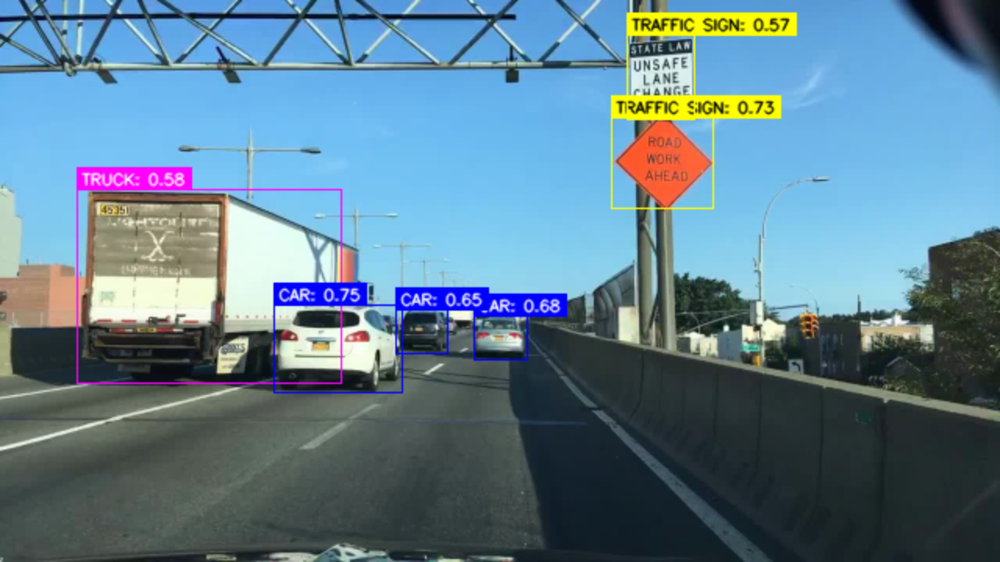
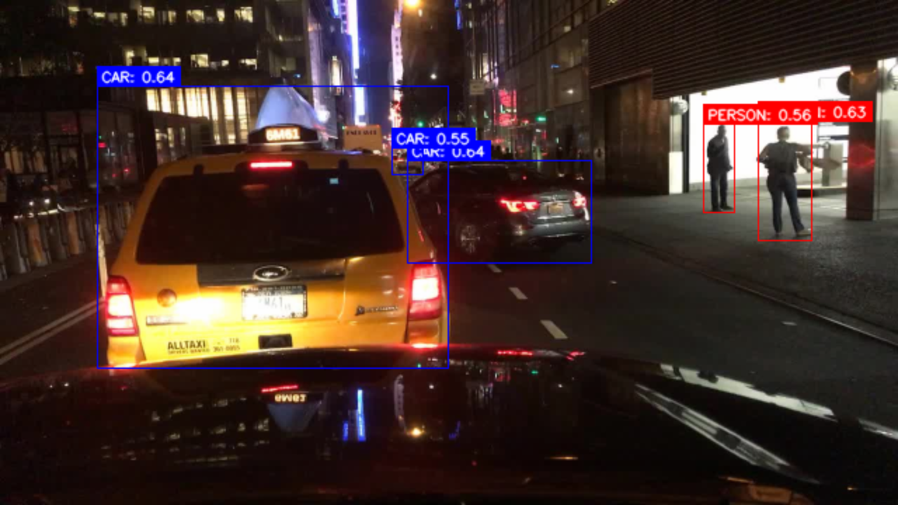
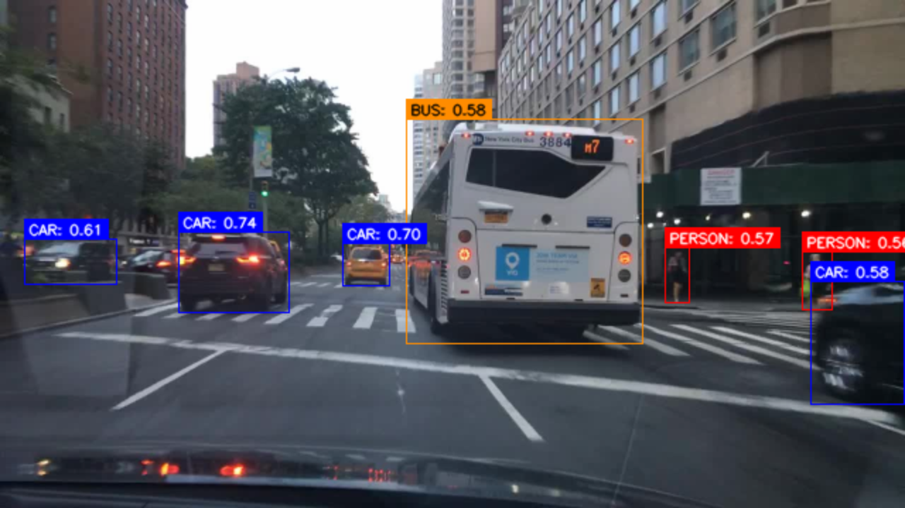

# 🚗 Road Eye: Detecting and Classifying Road Objects

A computer vision project that detects and classifies road objects — vehicles, pedestrians, and traffic signs — from real-world driving images using transfer learning and a custom object detection pipeline.

---

## Overview

Road Eye applies transfer learning with a pretrained ResNet CNN, fine-tuned on the [Berkeley DeepDrive 100K (BDD100K)](https://bair.berkeley.edu/blog/2018/05/30/bdd/) dataset. The model produces bounding boxes with class labels and confidence scores for objects found in static road images.

---

## Model Architecture

The detection pipeline is composed of three stages:

| Stage | Component | Role |
|-------|-----------|------|
| **Backbone** | ResNet (pretrained) | Extracts visual features — edges, textures, shapes |
| **Neck** | Feature Pyramid Network (FPN) | Combines and refines feature maps across scales to handle small, medium, and large objects |
| **Head** | FCOS (Fully Convolutional One-Stage Detector) | Generates bounding box coordinates and confidence scores per class |

---

## Dataset

- **BDD100K** — Berkeley DeepDrive 100K dataset
- 10 object categories including cars, pedestrians, traffic signs, bikes, motorcycles, buses, and trains

---

## Features

### MVP (Implemented)
- Full detection pipeline: ResNet → FPN → FCOS
- Transfer learning from pretrained ResNet weights
- Training and validation on BDD100K
- Visual output: bounding boxes with class labels and confidence scores

### Future Work
- Real-time video inference (frame-by-frame processing)
- Performance optimization for real-time use
- Web app demo interface for interactive predictions
- Collapsing 10 categories into broader groups (vehicles, pedestrians, signs) to reduce class imbalance

---

## Technical Challenges & Solutions

### Class Imbalance
The BDD100K dataset is heavily skewed — cars have over 1,000,000 instances while rare classes like `train` (~179 instances) and `motorcycle` (~4,000) are severely underrepresented. This caused the model to overfit toward dominant classes.

**Solutions applied:**

- **Loss Weighting** — Assigned higher penalties to rare classes using inverse-frequency weights (e.g., `car → 1`, `bike → 10`, `train → 50`), forcing the model to pay more attention to underrepresented categories.
- **Leaky ReLU over ReLU** — Rare classes produce weaker activation signals that standard ReLU zeros out entirely. Leaky ReLU scales them down instead of discarding them, keeping rare-class features alive through training.

Both solutions improved performance but did not fully resolve the imbalance — an expected limitation given the scale of the skew. Broader category grouping is planned as a future fix.

---

## Results
Example:

---

## Tech Stack

- **Python**
- **PyTorch** — model training and inference
- **ResNet / FPN / FCOS** — detection pipeline
- **BDD100K** — training dataset
- **Flask** — demo web server

---

## Motivation

This project was built to gain hands-on experience with the full machine learning pipeline — data preprocessing, model training and fine-tuning, and evaluation — while exploring a genuine interest in computer vision and its real-world applications. It also served as a foundation for exploring graduate research in AI and computer vision.
